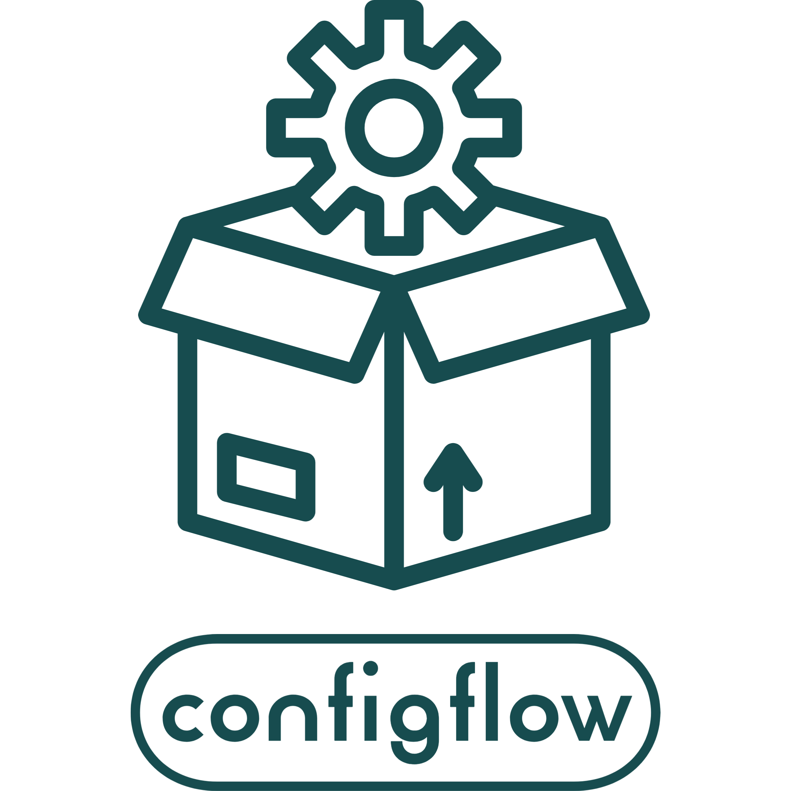

======================================
Welcome to configflow's documentation!
======================================

|

.. image:: https://img.shields.io/badge/License-MIT-red
    :target: https://choosealicense.com/licenses/mit
    :alt: license
.. image:: https://img.shields.io/badge/python-3.7%20%7C%203.8%20%7C%203.9-blue
    :target: https://pypi.org/project/configflow
    :alt: python
.. image:: https://img.shields.io/badge/Made%20with-Sphinx-1f425f.svg
    :target: https://www.sphinx-doc.org/en/master
    :alt: sphinx
.. image:: https://img.shields.io/badge/docstrings-numpy-gree.svg
    :target: https://numpydoc.readthedocs.io/en/latest/format.html
    :alt: docstrings
.. image:: https://img.shields.io/badge/code%20style-black-000000.svg
    :target: https://github.com/psf/black
    :alt: black
.. image:: https://img.shields.io/badge/%20imports-isort-%231674b1?style=flat&labelColor=ef8336
    :target: https://pycqa.github.io/isort/docs/configuration/options.html
    :alt: isort
.. image:: https://img.shields.io/badge/%20imports-pycln-%231674b1?style=flat&labelColor=ef8336
    :target: https://hadialqattan.github.io/pycln
    :alt: pycln
.. image:: https://img.shields.io/badge/style-wemake-000000.svg
    :target: https://wemake-python-stylegui.de/en/latest/index.html
    :alt: wemake
.. image:: https://img.shields.io/badge/mypy-checked-blue
    :target: https://mypy.readthedocs.io/en/stable/index.html
    :alt: mypy
.. image:: https://github.com/volodymyrPivoshenko/configflow/actions/workflows/integration.yaml/badge.svg?branch=main
    :alt: ci
.. image:: https://github.com/volodymyrPivoshenko/configflow/actions/workflows/deployment.yaml/badge.svg?branch=main
    :alt: cd
.. image:: https://readthedocs.org/projects/configflow/badge/?version=latest
    :target: https://configflow.readthedocs.io/en/latest
    :alt: docs
.. image:: https://badge.fury.io/py/configflow.svg
    :target: https://pypi.org/project/configflow
    :alt: pypi
.. image:: https://codecov.io/gh/volodymyrPivoshenko/configflow/branch/main/graph/badge.svg?token=yyck08xfTN
    :alt: coverage
.. image:: https://img.shields.io/lgtm/alerts/g/volodymyrPivoshenko/configflow.svg?logo=lgtm&logoWidth=18
    :target: https://lgtm.com/projects/g/volodymyrPivoshenko/configflow/alerts
    :alt: alerts
.. image:: https://img.shields.io/lgtm/grade/python/g/volodymyrPivoshenko/configflow.svg?logo=lgtm&logoWidth=18
    :target: https://lgtm.com/projects/g/volodymyrPivoshenko/configflow/context:python
    :alt: lgtm
.. image:: https://img.shields.io/github/issues/volodymyrPivoshenko/configflow
    :target: https://github.com/volodymyrPivoshenko/configflow/issues
    :alt: issues
.. image:: https://img.shields.io/github/issues-pr/volodymyrPivoshenko/configflow
    :target: https://github.com/volodymyrPivoshenko/configflow/pulls
    :alt: pr
.. image:: https://img.shields.io/github/contributors/volodymyrPivoshenko/configflow
    :target: https://github.com/volodymyrPivoshenko/configflow/graphs/contributors
    :alt: contributors
.. image:: https://img.shields.io/github/last-commit/volodymyrPivoshenko/configflow.svg
    :target: https://github.com/volodymyrPivoshenko/configflow/commits/main
    :alt: commits
.. image:: https://cdn.buymeacoffee.com/buttons/v2/default-blue.png
    :target: https://www.buymeacoffee.com/volo.pivoshenko
    :alt: buymeacoffee
    :width: 180
    :height: 60
    :align: center

Overview
========

``configflow`` - is the configuration management library for Python. It easily allows you to:

- Load your configuration from config files, environment variables, command-line arguments and more sources.
- Transform the loaded data into the desired format and validate it.
- Access the results as ``Python dataclass-like objects`` with full IDE support.
- Make your codebase very flexible by the usage of:

    - Multiple environments.
    - Singletons with lazy loading.
    - Config changes for the unit tests.
    - Custom config sources.

Examples
========

.. TODO add examples

See Also
========

.. TODO add references

.. toctree::
    :maxdepth: 1
    :caption: Table of Contents

    modules/installation.rst
    api/io.rst
    api/misc.rst
